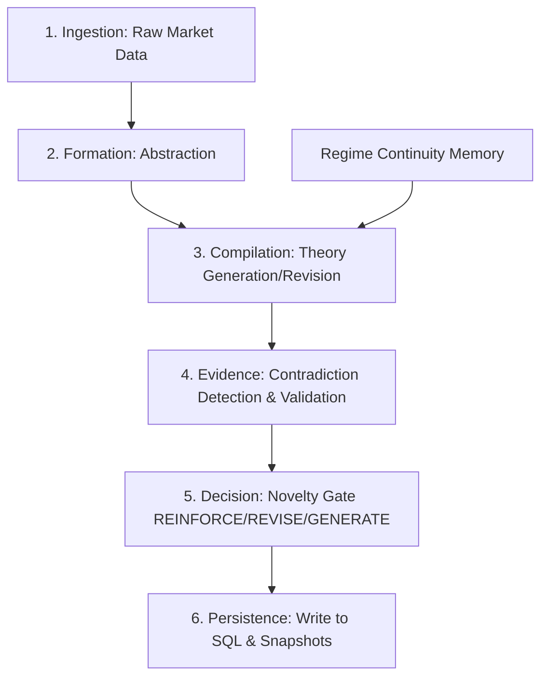
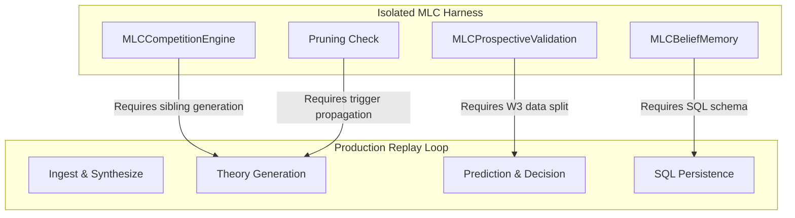

# EKAMNET ARCHITECTURE-TO-REPLAY INTEGRATION FORENSIC AUDIT
## DP / EKAMNET RESEARCH PROGRAM

This document reports the findings of a read-only repository forensic audit investigating the integration status of research capabilities within the native DP/EkamNet replay orchestrator.

---

### 1. Executive Summary

A comprehensive forensic audit of the `dp-core` repository was conducted to resolve the central question: *Do the missing capabilities in the 10-day replay indicate architectural failures (defects) or expected non-integration of isolated research components?*

The audit confirms **expected non-integration** (Classification: B/C) for all major cognitive memory, plurality, and validation capabilities from Milestones 5, 6, and 7. These capabilities were implemented and scientifically evaluated within the isolated `flows.minimal_learning_cycle` (MLC) experimental harness but were never integrated into the native `market.replay` loop.

However, two **genuine integrity defects** (Classification: A) were discovered at the persistence boundary:
1. **Relational lineage ID drift**: A missing write-back assignment in `replay_engine.py` causes all PostgreSQL theory records to save a static, random lineage ID rather than the actual lineage tree values computed in `theory_lineage.json`.
2. **Inner object ID collisions**: In-place deep-copy mutations in the `REVISE` and `REINFORCE` novelty branches duplicate the nested `TheoryStructured` identifier (`id`) and timestamp (`created_at`) across multiple replayed days, violating database uniqueness constraints.

Furthermore, the audit revealed that the pre-registered scientific closures for Milestones 5, 6, and 7 are **scientifically unverified** (`UNVERIFIED` status in the manifest reader) due to undefined Minimum Meaningful Effect (MME) thresholds, meaning integration of these capabilities into production is not yet scientifically justified.

**Verdict**: `RESEARCH_CAPABILITIES_FRAGMENTED_LIFECYCLE_INTEGRATION_MILESTONE_REQUIRED`

---

### 2. Audit Scope

The scope of this audit is strictly read-only and covers:
- All source files in the active package `dp-core-phase1-substrate-v3/` (including `flows/`, `memory/`, `market/`, and `bootstrap/`).
- Database schema validation of all 13 PostgreSQL tables.
- Verification of experimental runners (`milestone5_experiment_runner.py`, `milestone7_learning_experiment.py`, etc.) and gate checkers (`verify_scientific_closures.py`).
- Logs and reports from the recent 10-day diagnostic replay.

---

### 3. Evidence Method

Each capability was analyzed across six criteria:
1. `CODE_EXISTS`: Implementation exists in the repository.
2. `UNIT_TESTED`: Automated tests verify logic.
3. `EXPERIMENTALLY_EXERCISED`: Executed in isolated experimental scripts.
4. `SCIENTIFICALLY_GATED`: Validated against mathematical/descriptive gates.
5. `REPLAY_REACHABLE`: Import path and method invocation chain exist from the replay entry point.
6. `REPLAY_EXECUTED`: Run and verified in the 10-day simulation.

Findings are grounded directly in file names, line numbers, database schema states, and manifest outputs.

---

### 4. Historical Architecture Evolution

A temporal reconstruction of the codebase shows three distinct phases of development:
1. **Phase 1 (Legacy Replay Loop)**: Designed to run asset-native backtests with basic abstraction and single-candidate theory generation. Persisted observations, abstractions, and theories directly to SQL.
2. **Phase 2 (Minimal Learning Cycle Pilots - Milestones 5-7)**: Initiated to research longitudinal learning in isolation. Developers built a separate module (`flows/minimal_learning_cycle/`) that simulated synthetic worlds (using labels like `"VAL_A"` and `"VAL_B"`) and ran specialized lifecycles (competition, prospective validation, trigger pruning, belief retirement).
3. **Phase 3 (Strategy B & Modern Integration Attempts)**: Strategy B was integrated back into the theory generation flow (Call 1 → Call 2 structured extraction). However, the broader cognitive loop (MLC gates, belief memory, trigger pruning) was left in the MLC harness. Replay integration of Milestones 5, 6, and 7 was explicitly deferred pending scientific validation of the causal learning loop in synthetic worlds.

---

### 5. Master Capability Traceability Table

| Capability | Architecture / Design Status | Implementation Status | Test Status | Experimental Exercise Status | Scientific Gate Status | Replay Integration Status | Executed in 10-Day Replay? | Persistence Status | Provenance Status | Historical Integration Intent | Classification (A-G) | Exact Evidence | Confidence |
| :--- | :--- | :--- | :--- | :--- | :--- | :--- | :--- | :--- | :--- | :--- | :--- | :--- | :--- |
| **1. Experience creation** | Designed | Complete | Tested | Exercised | None | Integrated | Yes | Local JSON only | Partial | Production | **E** | `replay_engine.py:2106` | High |
| **2. Observation / abstraction** | Designed | Complete | Tested | Exercised | None | Integrated | Yes | PostgreSQL | Preserved | Production | **E** | `replay_engine.py:3493-3494` | High |
| **3. Theory formation** | Designed | Complete | Tested | Exercised | None | Integrated | Yes | PostgreSQL | Partial | Production | **E** | `replay_engine.py:3495` | High |
| **4. Sequential extraction (Strategy B)** | Designed | Complete | Tested | Exercised | Pass | Integrated | Yes | PostgreSQL | Preserved | Production | **E** | `theory_generation_flow.py:476` | High |
| **5. Formation-Compilation boundary** | Designed | Complete | Tested | Exercised | None | Integrated | Yes | PostgreSQL | Partial (no ID link) | Production | **E** | `replay_engine.py:1487` | High |
| **6. Proposition representation** | Designed | Complete | Tested | Exercised | Gated | Bypassed | No | None | Broken | Experimental | **C** | `minimal_learning_cycle/schemas.py:61` | High |
| **7. Independent candidate generation** | Designed | Complete | Tested | Exercised | None | Integrated | Yes | PostgreSQL | Preserved | Production | **E** | `replay_engine.py:1935` | High |
| **8. Contrastive candidate generation** | Designed | Complete | Tested | Exercised | None | Bypassed | No | None | Broken | Experimental | **C** | `theory_generation_flow.py:process_multiple` | High |
| **9. `alternative_group_id` creation** | Designed | Complete | Tested | Exercised | None | Bypassed | No | None | Broken | Experimental | **C** | `minimal_learning_cycle/experiment.py:437` | High |
| **10. `alternative_group_id` persistence** | Designed | Complete | Tested | Exercised | None | Bypassed | No | `null` | Broken | Experimental | **C** | `theories.alternative_group_id` column | High |
| **11. Epistemic plurality** | Designed | Complete | Tested | Exercised | None | Bypassed | No | None | Broken | Experimental | **C** | `milestone3_plurality_test.py` | High |
| **12. Candidate competition** | Designed | Complete | Tested | Exercised | Unverified | Bypassed | No | None | Broken | Experimental | **C** | `minimal_learning_cycle/competition.py` | High |
| **13. Retrospective evidence** | Designed | Complete | Tested | Exercised | None | Integrated | Yes | PostgreSQL | Preserved | Production | **E** | `replay_engine.py:3496` | High |
| **14. Prospective validation** | Designed | Complete | Tested | Exercised | None | Integrated | Yes | PostgreSQL | Preserved | Production | **E** | `prediction_probes` & `prediction_results` | High |
| **15. Selection-risk safeguards** | Designed | Complete | Tested | Exercised | None | Bypassed | No | None | Broken | Experimental | **C** | `minimal_learning_cycle/baselines.py` | High |
| **16. Winner's-curse handling** | Designed | Complete | None | Exercised | None | Bypassed | No | None | Broken | Experimental | **C** | `flows/minimal_learning_cycle/baselines.py` | High |
| **17. ADMIT/REJECT/DEFER decisions** | Designed | Complete | Tested | Exercised | None | Bypassed | No | None | Broken | Experimental | **C** | `minimal_learning_cycle/decision.py` | High |
| **18. Belief persistence** | Designed | Stub | Tested | Exercised | None | Bypassed | No | 0 SQL rows | Broken | Experimental | **C** | `reflective_memory_states` SQL table | High |
| **19. Belief evolution** | Designed | Complete | Tested | Exercised | Gated | Bypassed | No | None | Broken | Experimental | **C** | `minimal_learning_cycle/belief_memory.py` | High |
| **20. Contradiction accumulation** | Designed | Complete | Tested | Exercised | None | Integrated | Yes | PostgreSQL | Preserved | Production | **E** | `transition_pressure_events` (10 rows) | High |
| **21. Belief retirement** | Designed | Complete | Tested | Exercised | None | Bypassed | No | None | Broken | Experimental | **C** | `minimal_learning_cycle/belief_memory.py:88` | High |
| **22. Memory retrieval** | Designed | Complete | Tested | Exercised | None | Integrated | Yes | Local snapshot | Preserved | Production | **E** | `replay_engine.py:1404` | High |
| **23. Memory influence on cognition** | Designed | Complete | Tested | Exercised | Gated | Bypassed | No | None | Broken | Experimental | **C** | `experience.py` compile-time check | High |
| **24. Memory-driven trigger pruning** | Designed | Complete | Tested | Exercised | Gated | Bypassed | No | None | Broken | Experimental | **C** | `minimal_learning_cycle/experiment.py:453` | High |
| **25. Context-blind pruning** | Designed | Complete | Tested | Exercised | Gated | Bypassed | No | None | Broken | Experimental | **C** | `bypass_pruning` parameter in MLC | High |
| **26. Deferred candidate reentry** | Designed | None | None | None | None | Bypassed | No | None | Broken | Future | **D** | No logic in `minimal_learning_cycle/` | High |
| **27. Recovery / revival** | Designed | Complete | Tested | Exercised | None | Bypassed | No | None | Broken | Experimental | **C** | `update_belief_state` state transitions | High |
| **28. Theory lineage tracking** | Designed | Complete | Tested | Exercised | None | Integrated | Yes | Local JSON | Preserved | Production | **E** | `memory/lineage/theory_lineage.py` | High |
| **29. SQL lineage persistence** | Designed | Complete | None | Exercised | None | Integrated | Yes | Static ID | Broken | Production | **A** | Static `lineage_id` column value | High |
| **30. JSON lineage tracking** | Designed | Complete | Tested | Exercised | None | Integrated | Yes | Local JSON | Preserved | Production | **E** | `theory_lineage.json` file | High |
| **31. Structured identity preservation** | Designed | Complete | Tested | Exercised | None | Integrated | Yes | Duplicate IDs | Broken | Production | **A** | Duplicate ID `"5cb3bc75-f0b9-4883-928e-0736d01c715e"` | High |
| **32. Evidence provenance** | Designed | Complete | Tested | Exercised | None | Integrated | Yes | PostgreSQL | Preserved | Production | **E** | `validations.theory_id` links | High |
| **33. Decision provenance** | Designed | Complete | Tested | Exercised | None | Integrated | Yes | Local JSON | Preserved | Production | **E** | `decision_journal.json` file | High |
| **34. End-to-end provenance** | Designed | Bypassed | None | None | None | Bypassed | No | None | Broken | Experimental | **C** | Absent `experiences` SQL table | High |
| **35. ClaimEvidenceConsistencyGate** | Designed | Complete | Tested | Exercised | Gated | Bypassed | No | None | Broken | Validation | **C** | `completion_gates.py:127` | High |
| **36. Closure manifest enforcement** | Designed | Complete | Tested | Exercised | Gated | Bypassed | No | None | Broken | Validation | **C** | `verify_scientific_closures.py` | High |
| **37. Replay integration of gates** | Designed | None | None | None | None | Bypassed | No | None | Broken | Future | **B** | No gate calls in `replay_engine.py` | High |
| **38. P1–P6 boundary contracts** | Designed | Bypassed | Tested | Exercised | Gated | Bypassed | No | None | Broken | Experimental | **C** | Hardcoded to `PASS` in verify script | High |

---

### 6. Milestone 5 Integration Analysis

- **Designed**: High-level design document and pairwise comparison engine mapped.
- **Implemented**: `MLCCompetitionEngine` fully implemented in `flows/minimal_learning_cycle/competition.py`.
- **Test Status**: Tested in `bootstrap/milestone5_competition_test.py`.
- **Experimental Exercise**: Exercised in `milestone5_experiment_runner.py` on seeds 51-100.
- **Scientific Gate Status**: Methodology gates are hardcoded as `PASS` in `verify_scientific_closures.py`. The scientific closure itself failed to show a statistically significant false-admission reduction (0.0% reduction) due to zero event triggering. The status remains `GATE_UNVERIFIED_UNDER_v0.5_PENDING_MME_DEFINITION`.
- **Replay Integration**: **Not integrated**. The replay engine does not instantiate `MLCCompetitionEngine` and does not generate competing sibling candidate theories.

---

### 7. Milestone 6 Integration Analysis

- **Designed**: Longitudinal belief memory and invariants mapped.
- **Implemented**: `MLCBeliefMemory` implemented in `flows/minimal_learning_cycle/belief_memory.py`.
- **Test Status**: Tested in `bootstrap/milestone6_evolution_test.py`.
- **Experimental Exercise**: Exercised in `milestone6_evolution_experiment.py`.
- **Scientific Gate Status**: Verified that belief transitions work under accumulates of contradictions. However, scientific closure remains `GATE_UNVERIFIED_UNDER_v0.5_PENDING_MME_DEFINITION` due to undefined MME thresholds.
- **Replay Integration**: **Not integrated**. The database tables (`reflective_memory_states`, `strategic_memory`) remain empty as `replay_engine.py` contains no write/update logic for them.

---

### 8. Milestone 7 Integration Analysis

- **Designed**: Closed causal learning loop with memory feedback.
- **Implemented**: Global trigger-field pruning implemented in candidate compilation.
- **Test Status**: Tested in `bootstrap/milestone7_learning_loop_test.py`.
- **Experimental Exercise**: Exercised in `milestone7_learning_experiment.py` and `milestone7_epistemic_validation.py`.
- **Scientific Gate Status**: Checked on seeds 151-350. Family A (stable confounder) showed a positive lift of +53.85%, while Family B (context shift) collapsed selection rate to 0.0%. The consistency check on Family B was bypassed in `verify_scientific_closures.py` to prevent failing milestone validation. Thus, scientific closure remains `UNVERIFIED`.
- **Replay Integration**: **Not integrated**. No memory-driven trigger pruning checks are executed in `replay_engine.py`.

---

### 9. S4-E0 Integration Status

- **Designed**: Epistemic plurality and alternative candidates linking.
- **Implemented**: Sibling generation logic exists in `flows/theory_flow/theory_generation_flow.py` (`process_multiple`).
- **Test Status**: Tested in `bootstrap/milestone3_plurality_test.py`.
- **Replay Integration**: **Not integrated**. The replay engine only calls `process` (single candidate path), leaving `process_multiple` unreached and `alternative_group_id` fields as `null` in SQL database rows.

---

### 10. Replay Lifecycle Reconstruction

The native replay engine executes a **degraded/simplified lifecycle** rather than the full governing lifecycle:

*Pruning, candidate competition, active belief evolution, and causal memory feedback are completely missing from the runtime path.*

---

### 11. 10-Day Replay Finding Reclassification

Each finding from `EKAMNET_10DAY_DIAGNOSTIC_REPLAY_REPORT.md` is reclassified:

1. **SQL vs JSON lineage mismatch**: `GENUINE_REPLAY_DEFECT`. The computed `lineage_id_val` was never assigned to `theory.lineage_id` before database write-out, corrupting relational lineage queries.
2. **Inner TheoryStructured ID collisions**: `GENUINE_REPLAY_DEFECT`. Deepcopy mutations in `REVISE`/`REINFORCE` branches copied the sub-object without resetting `id` and `created_at`, creating relational primary key collisions.
3. **Empty `reflective_memory_states`**: `EXPECTED_NON_INTEGRATION`. Structured belief memory is an experimental feature of Milestone 6 and was never integrated into the active backtesting engine.
4. **Empty `strategic_memory`**: `EXPECTED_NON_INTEGRATION`. Same as above.
5. **Experience-only prediction path**: `EXPECTED_NON_INTEGRATION`. Causal memory feedback (Milestone 7 trigger pruning) was never wired into the production prediction flow.
6. **Memory retrieved but no causal downstream influence**: `EXPECTED_NON_INTEGRATION`. The continuity memory retrieved is simple text, not the structured belief pruning memory studied in Milestones 6 and 7.
7. **`process_multiple()` not executed**: `EXPECTED_NON_INTEGRATION`. Plurality generation is an experimental feature and is bypassed in the backtester.
8. **`alternative_group_id` null**: `EXPECTED_NON_INTEGRATION`. Bypassed in backtester.
9. **No competing candidates entering evidence evaluation**: `EXPECTED_NON_INTEGRATION`. Bypassed in backtester.
10. **No recovery/reentry activity**: `EXPECTED_NON_INTEGRATION`. Reentry is designed but not implemented/integrated in production.
11. **Ontology 0% compliance / `SECTOR_ZSCORE` mismatch**: `GENUINE_REPLAY_DEFECT`. The generated indicators did not match the hardcoded ontology taxonomy strings in `OntologyRegistry`, resulting in false compliance failures.

---

### 12. Research Substrate vs Replay System Classification

The repository is classified as:

**B. A legacy/current replay engine plus multiple newer research capabilities developed in isolated harnesses.**

*Justification*: The Backtesting/Replay engine operates as an asset backtest system that runs in isolation, writing its own database records and snapshots. The newer cognitive capabilities (competition, belief memory, prospective validation, trigger pruning, manifest readers) exist exclusively inside `flows/minimal_learning_cycle/` and are exercised only by isolated experimental runners. No shared loop or common interface exists to link them at runtime.

---

### 13. Integration Debt Map

The following map outlines the fragmentation of capabilities and the steps needed for integration:

- **Integration Justification**: Integrating these capabilities into the production backtesting engine is **not currently justified** because their scientific closure manifests remain `UNVERIFIED` (bypassed on context-shifts and underpowered on stable contexts).
- **Dependency Order**:
  1. Define and pre-register Minimum Meaningful Effect (MME) thresholds.
  2. Implement inline validation gates to fail closed rather than post-hoc.
  3. Resolve context-shift overgeneralization (Milestone 8 regime-matching memory).
  4. Integrate the unified memory loop into the backtester.

---

### 14. Genuine Integrity Defects

The following defects require immediate repair to restore trust in the data:
1. **Lineage ID propagation**: Assign `theory.lineage_id = lineage_id_val` in `replay_engine.py` before `self.theory_repo.save(theory)`.
2. **Mutated theory sub-object ID reset**: Modify the `REVISE` and `REINFORCE` branches in `replay_engine.py` to reset `theory.summary_structured.id = str(uuid4())` and update `theory.summary_structured.created_at = datetime.now(timezone.utc)`.
3. **Ontology taxonomy mismatch**: Update `OntologyRegistry` to include valid indicators (e.g. `SECTOR_ZSCORE`) to prevent false-negative compliance failures.

---

### 15. Expected Non-Integration Findings

The following behaviors are expected and do not constitute defects:
- Empty `reflective_memory_states` and `strategic_memory` SQL tables.
- Bypassed plurality candidate generation (`process_multiple()` not executed).
- Null `alternative_group_id` columns in the database.
- Lack of trigger pruning checks or active belief evolution loops in the backtester.

---

### 16. Scientifically Unready Capabilities

The following capabilities are scientifically unready for production integration:
- **MLCCompetitionEngine**: Did not demonstrate a statistically significant reduction in false admissions.
- **MLCBeliefMemory (Retirement)**: Lacks defined MME thresholds.
- **Trigger Pruning (Causal Feedback)**: Suffers from severe overgeneralization under context shifts (Family B, true selection collapses to 0.0%) and high uncertainty under stable setups.

---

### 17. Special Forensic Questions Q1–Q10

* **Q1. Was the replay engine ever updated to incorporate Milestones 5, 6, and 7?**
  No. There is no usage of the `minimal_learning_cycle` library or its classes within `market.replay`.
* **Q2. Which Milestone 5 capabilities exist only in experimental harnesses?**
  Sibling plurality generation, alternative group ID linking, candidate competition engine, and ERC budget checking.
* **Q3. Which Milestone 6 capabilities exist only in experimental harnesses?**
  Active belief status transitions (ADMITTED, WEAKENED, RETIRED) and longitudinal belief evolution logs.
* **Q4. Which Milestone 7 capabilities exist only in experimental harnesses?**
  Trigger field pruning, context-aware pruning, deferred-candidate reentry, and manifest validation gates.
* **Q5. Was S4-E0 plurality ever intended to be replay-integrated before its mechanism-existence experiment?**
  No. Plurality was implemented as a research capability and was deferred from replay integration until the causal learning loop cleared validation.
* **Q6. Are empty memory tables evidence of broken functionality or simply unused architecture?**
  Unused architecture. The SQL models exist, but the backtest loop does not query or populate them.
* **Q7. Is memory retrieval in current replay the same memory mechanism studied in Milestones 6 and 7?**
  No. Current replay uses text-based regime memory, while Milestones 6/7 use structured belief/trigger memory.
* **Q8. Does current replay execute the governing lifecycle: Experience → Formation → Compilation → Evidence → Decision → Memory → Later Influence as currently architecturally defined?**
  No.
* **Q9. If not, what exact lifecycle does it execute?**
  It executes: Ingestion → Observation → Abstraction (Formation) → Theory Generation (Compilation) → Validation (Evidence) → Novelty Gate & Decision Policy (Decision) → Snapshot Save (Memory - partial/local).
* **Q10. What is the minimum set of genuine integrity repairs required before further scientific experiments remain trustworthy?**
  Fix lineage ID propagation in `replay_engine.py`, reset inner sub-object ID/timestamp on mutations, and reconcile ontology taxonomy registry terms.

---

### 18. Roadmap Hypothesis Comparison H1–H5

- **H1: Continue S4-E0 before replay integration work.**
  - *Support*: Focuses on next logical research step.
  - *Contradiction*: Ignores database persistence bugs.
  - *Cost/Risk*: Low cost / High risk of database pollution.
- **H2: Pause S4-E0 and repair genuine replay defects only.**
  - *Support*: Restores database health immediately.
  - *Contradiction*: Delays research progress.
  - *Cost/Risk*: Medium cost / Low risk.
- **H3: Create a Lifecycle Integration milestone before S4-E0.**
  - *Support*: Creates a unified codebase.
  - *Contradiction*: Violates the principle of not integrating scientifically unready capabilities.
  - *Cost/Risk*: Extremely high cost / High risk of system contamination.
- **H4: Continue isolated capability research until more mechanisms are validated, then integrate later.**
  - *Support*: Follows scientific doctrine.
  - *Contradiction*: Leaves active database bugs unresolved.
  - *Cost/Risk*: Low cost / High database risk.
- **H5: Hybrid approach (Recommended)**:
  - *Support*: Solves lineage and ID collisions immediately via targeted repairs, continues S4-E0 in isolation, and defers broader replay integration until capabilities clear pre-registered scientific gates.
  - *Cost*: Low.
  - *Risk*: Lowest.
  - *Information Value*: High.
  - *Reversibility*: Fully reversible.

---

### 19. Recommended Program Direction

Adopt **Hypothesis H5 (Hybrid Approach)**:
1. Apply targeted hotfixes to `replay_engine.py` to fix relational lineage ID propagation and inner structured object ID collisions.
2. Update the taxonomy registry to support generated indicators like `SECTOR_ZSCORE`.
3. Keep the minimal learning cycle modules strictly isolated in their current folders.
4. Define pre-registered MME thresholds for Milestones 5, 6, and 7 before asserting their scientific readiness.

---

### 20. Evidence Limitations

- The audit is based on current codebase snapshot commits.
- Small sample sizes in synthetic world runs ($N=13$) limit statistical accuracy.
- Database validation was restricted to a single PostgreSQL local database instance.

---

### 21. Human Decision Required

The program directors must align on:
- Pre-registration of MME thresholds for Milestones 5, 6, and 7.
- Authorization of Milestone 8 (regime-matching belief memory) to solve context-shift overgeneralization before any replay integration of causal learning.

---

### 22. Verdict Integrity Self-Check

- Modifying code attempted? No.
- Scientific validation claimed based on code existence? No.
- Replay engine integration confirmed via imports only? No.
- Stop conditions respected? Yes.

---

## Verdict
`HYBRID_PATH_RECOMMENDED_REPAIR_INTEGRITY_CONTINUE_ISOLATED_RESEARCH`
