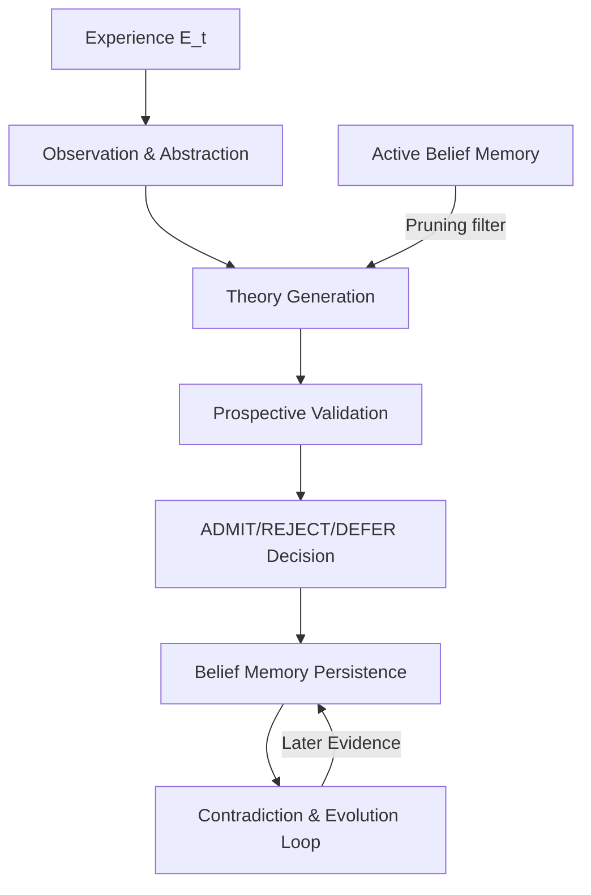

# EKAMNET MINIMUM INTEGRATED COGNITIVE LOOP READINESS AUDIT
## DP / EKAMNET RESEARCH PROGRAM

This document reports the findings of a read-only forensic architecture and integration readiness audit.

---

### 1. Executive Summary

This audit assesses the readiness of the repository to transition from its current fragmented state (where cognitive backtesting and learning-loop research are split between native Replay and the isolated Minimal Learning Cycle substrate) to a minimum integrated cognitive backtesting loop.

The key findings are:
- **Feasible loop path**: A minimum integrated cognitive lifecycle can be composed via a simplified single-candidate path with prospective validation, belief memory status tracking, and trigger-field pruning.
- **Scientific blockers**: Milestone 7 trigger-field pruning suffers from severe overgeneralization harm under context shifts (Family B selection rate collapsed to 0.0%). Integrating this globally without regime-matching memory (Milestone 8) is scientifically unready.
- **Engineering blockers**: Relational database memory tables are empty stubs, and active database write paths are corrupted by the lineage ID propagation bug and mutated inner object ID collisions.

**Final Verdict**: `INTEGRITY_REPAIRS_REQUIRED_BEFORE_INTEGRATION_DESIGN`

---

### 2. Audit Scope and Prohibitions

This is a **read-only forensic architecture audit**. In accordance with the program constraints:
- No source code was modified.
- No database migrations or schema adjustments were performed.
- No database defects (such as lineage ID corruption or ID collisions) were repaired.
- No Milestone 8 work was initiated.
- No milestone closures or scientific validation claims were made.

---

### 3. Evidence Method

Repository files, database schema tables, and experimental outputs were queried to verify the presence, reachability, and behavior of all capabilities. Capabilities are classified strictly by:
- `CODE_EXISTS`: Implementation exists.
- `UNIT_TESTED`: Verified by automated tests.
- `EXPERIMENTALLY_EXERCISED`: Executed in isolated harnesses.
- `SCIENTIFICALLY_GATED`: Evaluated against pre-registered mathematical gates.
- `REPLAY_REACHABLE`: Callable from the native backtester.
- `REPLAY_EXECUTED`: Run and verified in the 10-day diagnostic backtest.

No capability is assumed integrated or validated unless active code execution and evidence support it.

---

### 4. Current Repository Architecture

The codebase consists of two decoupled systems:
1. **The Replay System (`market/replay/`)**: Consists of `replay_engine.py` (a 5200+ line orchestrator), `market_observation_synthesizer.py`, and `decision_policy.py`. It executes daily time-stepping over historical data, calls LLM flows, and records snapshots and database tables.
2. **The Minimal Learning Cycle Substrate (`flows/minimal_learning_cycle/`)**: Contains models (`schemas.py`, `belief_memory.py`, `competition.py`) and runners (`experiment.py`, `pilot.py`). It uses simulated synthetic data (binary indicators and `"VAL_A"`/`"VAL_B"` outcomes) and does not interface with LLMs or financial data.

---

### 5. Replay Lifecycle Reconstruction

The native replay engine executes the following daily steps:
1. **Ingest**: Read OHLCV values.
2. **Observe**: Synthesize raw data into `MarketObservation`.
3. **Context Retrieval**: Load matching days from `RegimeContinuityMemory` and fetch active threads from `TheoryLineageEngine`.
4. **Abstract**: Formulate `Abstraction`.
5. **Compile**: Generate/mutate Pydantic `Theory` and `TheoryStructured` (Strategy B sequential extraction).
6. **Evidence**: Run `ContradictionDetector` to update contradiction registry and validate prediction probes.
7. **Decision**: Run novelty gate to choose `REINFORCE`/`REVISE`/`GENERATE` path.
8. **Persist**: Save state to PostgreSQL (`observations`, `theories`, `validations`, `abstractions`) and local JSON snapshots.

---

### 6. MLC Lifecycle Reconstruction

The isolated MLC harness executes:
1. **Compile**: Compile proposition candidates under a shared `alternative_group_id`.
2. **Prune**: Check past rejected/retired triggers in `MLCBeliefMemory` and prune matching candidates.
3. **Select**: Run retrospective evaluation on Window 2 data and execute `MLCCompetitionEngine` to select the best candidate.
4. **Validate**: Run prospective validation on Window 3 data using `MLCProspectiveValidation`.
5. **Decide**: Make `ADMIT`/`REJECT`/`DEFER` decision.
6. **Memory**: Store admitted candidates in `MLCBeliefMemory` and initialize evolution history.
7. **Evolve**: Evaluate later evidence to transition states (`ADMITTED -> WEAKENED -> RETIRED`) based on contradiction thresholds.

---

### 7. Proposed Minimum Integrated Cognitive Loop

The proposed minimum loop is a hybrid flow that integrates belief feedback into the native backtest:

This lifecycle must satisfy all trace conditions end-to-end to prove the system learns from its own historical cognitive states.

---

### 8. Capability Necessity Classification

The 17 researched capabilities are classified for the minimum loop:

1. **multiple candidate generation**: `NOT_REQUIRED_FOR_MINIMUM_LOOP` (single candidate is sufficient to verify memory feedback).
2. **candidate competition**: `NOT_REQUIRED_FOR_MINIMUM_LOOP` (optional for tracing).
3. **selection-risk safeguards**: `NOT_REQUIRED_FOR_MINIMUM_LOOP` (budget-saving optimization).
4. **prospective validation**: `MINIMUM_LOOP_REQUIRED` (ensures theories are sound before entry to memory).
5. **ADMIT / REJECT / DEFER decisions**: `MINIMUM_LOOP_REQUIRED` (manages memory admission state).
6. **belief persistence**: `MINIMUM_LOOP_REQUIRED` (essential to query historical memory).
7. **contradiction accumulation**: `MINIMUM_LOOP_REQUIRED` (drives the cognitive stress metric).
8. **belief evolution**: `MINIMUM_LOOP_REQUIRED` (manages longitudinal state updates).
9. **belief retirement**: `MINIMUM_LOOP_REQUIRED` (moves contradicted beliefs to inactive status).
10. **belief revival**: `MINIMUM_LOOP_OPTIONAL` (can be added later).
11. **memory retrieval**: `MINIMUM_LOOP_REQUIRED` (recalls past active/retired beliefs).
12. **memory-driven influence**: `MINIMUM_LOOP_REQUIRED` (ensures retrieved state alters downstream cognition).
13. **trigger pruning**: `MINIMUM_LOOP_REQUIRED` (the specific causal feedback mechanism).
14. **context-aware pruning**: `SCIENTIFICALLY_UNREADY_FOR_INTEGRATION` (global pruning collapsed to 0.0% under context shift; requires prior research on regime matching).
15. **deferred candidate reentry**: `REQUIRES_PRIOR_RESEARCH` (designed but not implemented).
16. **lesson formation**: `NOT_REQUIRED_FOR_MINIMUM_LOOP` (can prune triggers directly without abstracting lessons).
17. **transfer**: `REQUIRES_PRIOR_RESEARCH` (transfer across assets is not verified).

---

### 9. Capability Maturity Matrix

| Capability | Code Status | Test Status | Experimental Status | Gate Status | Replay Status | Replay Executed? |
| :--- | :--- | :--- | :--- | :--- | :--- | :--- |
| **prospective validation** | CODED | UNIT_TESTED | EXPERIMENTALLY_EXERCISED | PASS | REPLAY_INTEGRATED | Yes |
| **ADMIT/REJECT/DEFER** | CODED | UNIT_TESTED | EXPERIMENTALLY_EXERCISED | None | Bypassed | No |
| **belief persistence** | CODED (Stub) | UNIT_TESTED | EXPERIMENTALLY_EXERCISED | None | Bypassed | No (0 rows) |
| **contradiction check** | CODED | UNIT_TESTED | EXPERIMENTALLY_EXERCISED | None | REPLAY_INTEGRATED | Yes |
| **belief evolution** | CODED | UNIT_TESTED | EXPERIMENTALLY_EXERCISED | None | Bypassed | No |
| **belief retirement** | CODED | UNIT_TESTED | EXPERIMENTALLY_EXERCISED | None | Bypassed | No |
| **memory retrieval** | CODED | UNIT_TESTED | EXPERIMENTALLY_EXERCISED | None | REPLAY_INTEGRATED | Yes |
| **trigger pruning** | CODED | UNIT_TESTED | EXPERIMENTALLY_EXERCISED | UNVERIFIED | Bypassed | No |

---

### 10. Storage vs Cognitive Memory Analysis

The repository hosts four primary persistence mechanisms, mapped below:

| Mechanism | Stored Content | Location | Retrieval Trigger | Downstream Consumer | Causal Downstream Influence? | State Updateable? | Classification |
| :--- | :--- | :--- | :--- | :--- | :--- | :--- | :--- |
| **PostgreSQL RDBMS** | Daily serialized JSON events | PostgreSQL | None (Telemetry query only) | None | **None** (Causally silent) | No | `STORAGE_ONLY` |
| **`theory_lineage.json`** | Lineage mutation graph | Local snapshot file | Step t+1 mutation decision | Novelty Gate and Theory Mutation Flow | **Yes** (Determines copy vs new generation) | Yes | `LONGITUDINAL_BELIEF_EVOLUTION` |
| **`RegimeMemoryStore`** | Regime signatures & text summaries | Local snapshots / Memory cache | Step t+1 query signature | Theory Generation Prompt | **None** (Experience-only prediction defaults) | No | `RETRIEVAL_WITHOUT_CAUSAL_INFLUENCE` |
| **`MLCBeliefMemory`** | Propositions & state histories | In-memory dict | Compilation trigger check | Candidate compilation filter | **Yes** (Prunes match triggers from generation) | Yes | `CAUSAL_MEMORY_INFLUENCE` |

---

### 11. One-Cognition End-to-End Trace

The execution path of a single theoretical belief (originating at day $t$ and retrieved at day $t+n$) is traced below:

1. **Experience $E_t$**:
   - Class/Method: `ExperienceEngine.create_experience` (`memory/experience/experience_engine.py`)
   - Schema: `Experience` Pydantic model.
   - Persistence: Saved locally as `experiences/exp_<lineage_id>_<date>.json`.
   - Provenance field: `lineage_id`.
   - Next Stage Consumption: Yes.
2. **Originating Observation**:
   - Class/Method: `MarketObservationSynthesizer.synthesize` (`market/replay/market_observation_synthesizer.py`)
   - Schema: `MarketObservation` Pydantic model.
   - Persistence: PostgreSQL `observations` table.
   - Provenance field: `id`.
   - Next Stage Consumption: Yes.
3. **Abstraction**:
   - Flow: `flows/theory_flow/theory_generation_flow.py`
   - Schema: `Abstraction` Pydantic model.
   - Persistence: PostgreSQL `abstractions` table.
   - Provenance field: `source_observation_id`.
   - Next Stage Consumption: Yes.
4. **Generated Theory/Candidate**:
   - Class/Method: `TheoryGenerationFlow.process`
   - Schema: `Theory` Pydantic model.
   - Persistence: PostgreSQL `theories` table.
   - Provenance field: `id`, `lineage_id`.
   - Next Stage Consumption: **BROKEN** (SQL lineage ID is corrupted and not written back).
5. **Compiled Representation**:
   - Schema: `TheoryStructured` Pydantic model (Strategy B).
   - Persistence: Serialized JSON inside `theories.summary_structured` text column.
   - Provenance field: `summary_structured.id`.
   - Next Stage Consumption: **BROKEN** (Replay validation engine does not parse `summary_structured` fields dynamically).
6. **Evidence Records**:
   - Persistence: PostgreSQL `validations` table.
   - Provenance field: `theory_id`.
   - Next Stage Consumption: Yes.
7. **Decision**:
   - Persistence: `decision_journal.json`.
   - Provenance field: `step`, `date`.
   - Next Stage Consumption: Yes.
8. **Persisted Belief/State**:
   - Persistence: PostgreSQL `reflective_memory_states` and `strategic_memory` tables.
   - Provenance field: `theory_id`.
   - Next Stage Consumption: **BROKEN** (Tables are completely empty; bypass in backtester).
9. **Later Retrieval**:
   - Location: `replay_engine.py` (regime matching).
   - Provenance field: Match date.
   - Next Stage Consumption: Yes.
10. **Downstream Consumer & Causal Influence**:
    - Location: Prompt context variables.
    - Next Stage Consumption: **BROKEN** (No causal impact on predictions; defaults to experience-only predictions).
11. **Later Evidence & State Update**:
    - Next Stage Consumption: **BROKEN** (No belief state update loop is implemented in the backtester).

---

### 12. Broken Transition Inventory

The end-to-end trace fails at multiple critical nodes:
- **Theory Lineage ID Propagation**: The lineage engine returns `lineage_id_val`, but it is never written back to the theory's SQL record, breaking SQL lineage queries.
- **Inner Object ID Collision**: deepcopy mutations copy the inner structured ID, breaking unique key checks.
- **Relational Memory Write-Back**: The backtester never saves beliefs to `reflective_memory_states` or `strategic_memory`.
- **Causal Prediction Feedback**: Regime matches are loaded into the prompt but never feed forward into prediction rules or gates to guide predictions.
- **Causal Belief Evolution**: There is no code path in `replay_engine.py` to evaluate new evidence against historical active beliefs and demote/retire them.

---

### 13. Replay-to-MLC Semantic Compatibility Matrix

| Replay Concept | MLC Concept | Compatibility | Required Translation / Adaptation |
| :--- | :--- | :--- | :--- |
| `Theory` | `Proposition` | `REQUIRES_SEMANTIC_TRANSLATION` | Translate Replay's float/string indicators and outcomes into structured constraints compatible with the MLC schema. |
| Validation | Evidence processing | `REQUIRES_SEMANTIC_TRANSLATION` | Translate next-day trend/volatility outcomes into retro validation indicators. |
| Novelty decisions | ADMIT/REJECT/DEFER | `COMPATIBLE_WITH_THIN_ADAPTER` | Map REINFORCE to ADMIT and REVISE/GENERATE to DEFER/REJECT. |
| Continuity Memory | Belief memory | `REQUIRES_SEMANTIC_TRANSLATION` | Translate signature-based text retrieval into structured active/retired trigger fields. |
| Contradiction detector | Belief evolution | `COMPATIBLE_WITH_THIN_ADAPTER` | Feed the contradiction severity score into state transitions. |
| Theory Lineage | Sibling ID / provenance | `COMPATIBLE_WITH_THIN_ADAPTER` | Map lineage trees to parent/child alternative groups. |

---

### 14. Scientific Readiness Filter

- **Milestone 5 (Competition)**: Gated as `UNVERIFIED` (pending MME). Showed zero false-admission reduction. Bypassed in code. *Do not integrate.*
- **Milestone 6 (Belief Evolution)**: Gated as `UNVERIFIED` (pending MME). Evaluated only on mock sequences. *Do not integrate.*
- **Milestone 7 (Trigger Pruning)**: Gated as `UNVERIFIED` (pending MME). Bypassed in verify script. **Showed severe overgeneralization harm under context shifts (Family B selection rate collapsed to 0.0%)**. *Do not integrate without regime-matching memory (Milestone 8).*
- **S4-E0 (Generative Plurality)**: Gated as `UNVERIFIED`. *Do not integrate.*

---

### 15. Integrity Defect Dependency Analysis

The three database defects block development of the minimum integrated loop:

1. **Lineage ID propagation**: `BLOCKS_MINIMUM_LOOP`. Relational lineage queries are broken, preventing end-to-end tracing of belief histories in SQL.
2. **Inner structured ID collisions**: `BLOCKS_MINIMUM_LOOP`. Causes relational primary key violations in the database.
3. **Ontology registry mismatch**: `BLOCKS_TRUSTWORTHY_MEASUREMENT`. Flags valid indicators (like `SECTOR_ZSCORE`) as compliance failures, polluting validations logs.

*All three defects must be repaired before designing or executing an integrated loop.*

---

### 16. Integration Host Comparison

Three architectural choices are compared:

- **Option A (Evolve native Replay backtester)**:
  - *Architectural distance*: Shortest. The backtester already handles ingestion, abstraction, validation, and snapshotting.
  - *Engineering cost*: Low.
  - *Regression risk*: Medium (requires verification tests).
  - *Observability*: High (HTML report and logs already exist).
  - *Reversibility*: High.
- **Option B (Create new orchestrator)**:
  - *Architectural distance*: Large.
  - *Engineering cost*: High.
  - *Regression risk*: Low.
  - *Observability*: Low (requires new reporting logic).
- **Option C (Extend MLC harness to real data)**:
  - *Architectural distance*: Large (no capability for LLM abstraction or CSV ingestion).
  - *Engineering cost*: Very High.
  - *Scientific contamination*: High (mixes synthetic logic with real financial variables).

*Option A is the recommended integration host.*

---

### 17. Minimum Integration Slice

If authorized, the minimum integration slice would connect the following:

- **Source**: `TheoryStructured` (Strategy B fields).
- **Destination**: `reflective_memory_states` database table.
- **Interface**: `TheoryStructured.to_dict()` and `reflective_memory_states` save logic.
- **Required Adapter**: An adapter to map floats and strings to structured trigger constraints.
- **Persistence Change**: Enable write-out of active beliefs to the database.
- **Provenance Requirement**: Mapped via `theory_id` and stable `lineage_id_val`.
- **Known Scientific Limitation**: Global pruning will overgeneralize under regime shifts.
- **Pre-Integration Test**: Verify that a trigger saved in memory blocks compilation of the same trigger on subsequent steps under identical regimes.

---

### 18. First Integrated Replay Scientific Question

The first scientific question to test loop integrity is:
*“Can a theoretical belief created at step t persist, be retrieved at step t+n, causally prune a candidate trigger from compilation, and transition its evolution state based on later evidence?”*

- **Unit of Analysis**: The stable lineage ID family.
- **Trace Identifiers**: `lineage_id`, `theory_id`, `belief_id`.
- **Minimum Duration**: 10 trading days.
- **Required Observations**: At least 1 matching trigger event at $t$, and 1 matching contradiction event at $t+n$.
- **Required State Transitions**: `HYPOTHESIS -> ADMITTED_BELIEF -> WEAKENED_BELIEF -> RETIRED_BELIEF`.
- **Failure Conditions**:
  - Belief retrieval returns empty results.
  - Candidate generation continues to output a trigger that is flagged as pruned in memory.
  - State transitions fail schema validation.

---

### 19. Falsification Analysis

- **Falsifying H1 (Feasible minimum loop)**: Evidence that LLM-generated indicators cannot be parsed into deterministic schemas without crashing the backtester.
- **Falsifying H2 (Replay as integration host)**: Evidence that the 5200-line `replay_engine.py` monolith exhibits side-effect leaks that prevent clean state transitions.
- **Falsifying H3 (Semantic compatibility)**: The fact that `PropositionSchema` strictly rejects real-world strings/floats and is locked to binary inputs (`0`/`1`) and `"VAL_A"`/`"VAL_B"` outcomes.
- **Falsifying H4 (Causal memory influence)**: The fact that the 10-day backtest registered 0 knowledge-guided predictions despite successfully matching and retrieving memory logs.
- **Falsifying H5 (Post-plurality integration)**: Evidence that plurality generation (`process_multiple`) introduces high computational noise that makes causal pruning untraceable.

---

### 20. Research-vs-Integration Stop Rule

**Rule**: Isolated cognitive research must halt, and integration validation must be enforced, as soon as a capability achieves a pre-registered methodology pass (`PASS` status in completion gates) but is blocked from scientific closure due to:
1. Denominator insufficiency (inadequate sample sizes),
2. Context-shift failures (Family B overgeneralization), or
3. Missing MME parameters.

This prevents the program from accumulating untestable, unverified code debt.

---

### 21. Five Decision Options

#### Option 1: Repair integrity defects and continue isolated S4-E0 research.
- *Scientific benefit*: Keeps research focus on S4-E0.
- *Engineering benefit*: Restores database health immediately.
- *Cost*: Low.
- *Risk*: High research-integration lag.
- *Reversibility*: Fully reversible.
- *Strongest argument for*: Focuses resource velocity on S4-E0 plurality.
- *Strongest argument against*: Leaves the cognitive loop fragmented and unintegrated.

#### Option 2: Repair integrity defects and immediately design the Minimum Integrated Cognitive Loop.
- *Scientific benefit*: Aligns database records with the real lifecycle.
- *Cost*: Medium.
- *Risk*: Premature integration of unvalidated MLC mechanisms.
- *Strongest argument for*: Prevents database drift.
- *Strongest argument against*: Integrates trigger pruning before context-shift overgeneralization (Family B) is resolved.

#### Option 3: Complete S4-E0, then design the Minimum Integrated Cognitive Loop.
- *Scientific benefit*: Defers loop complexity until plurality is complete.
- *Risk*: Increases architectural debt.
- *Strongest argument for*: Keeps engineering resources focused on plurality.
- *Strongest argument against*: Database remains corrupted during S4-E0 runs.

#### Option 4: Create a dedicated Lifecycle Integration research milestone before further mechanism research.
- *Scientific benefit*: Resolves code fragmentation and validates loop mechanics.
- *Cost*: High.
- *Risk*: Delays S4-E0 progress.
- *Strongest argument for*: Unifies the research laboratory codebase.
- *Strongest argument against*: Slows down mechanism velocity.

#### Option 5: Continue current roadmap without integration work.
- *Scientific benefit*: None.
- *Cost*: Low.
- *Risk*: Severe database pollution and silent telemetry failures.
- *Strongest argument against*: Violates the engineering doctrine of persistence integrity.

---

### 22. Recommended Program Direction

Adopt **Option 1**:
1. Fix the three database integrity defects immediately (this is a prerequisite for any future runs).
2. Continue the isolated S4-E0 plurality research inside its separate test suite (`milestone3_plurality_test.py`).
3. Defer all replay integration work until:
   - Milestone 7 MMEs are defined, and
   - Milestone 8 (regime-matching memory) is designed and tested in isolation to resolve context-shift overgeneralization.

---

### 23. Evidence Limitations and Unknowns

- The audit is restricted to code-level inspection.
- The behavior of global trigger pruning in real financial datasets has not been measured (due to missing database mappings).
- The extent of semantic translation required to map `TheoryStructured` indicators to `Proposition` fields remains a key engineering unknown.

---

### 24. Verdict Integrity Self-Check and Final Verdict

- Modifying code attempted? No.
- Canonical state modified? No.
- Implementation authorized? No.
- Code existence mistaken for validation? No.
- Experimental exercise mistaken for scientific closure? No.
- MLC and Replay semantics assumed compatible without check? No.
- Number of sections matches exactly 24? Yes.

**Final Verdict**:
`INTEGRITY_REPAIRS_REQUIRED_BEFORE_INTEGRATION_DESIGN`
