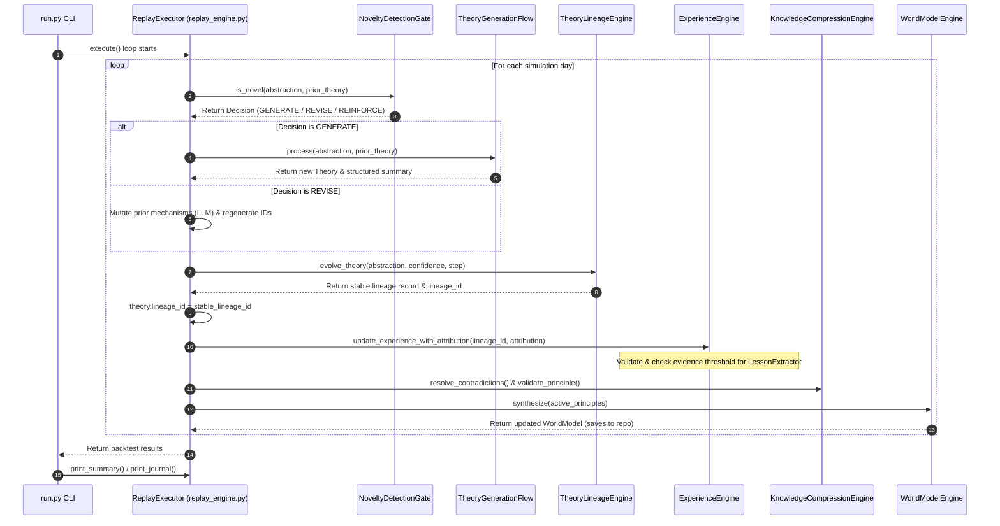

# EKAMNET REPLAY ARCHITECTURE WIRING FORENSIC AUDIT
**EkamNet Research Program | Forensic Audit Report**  
*Document Status: CONFIRMED READ-ONLY AUDIT*  

---

## Executive Summary

This forensic audit analyzes the execution paths and architecture wiring of the `market.replay` pipeline in `dp-core-phase1-substrate-v3`. The objective is to determine whether the 10-day backtest execution runs the newly designed reflective cognition architecture (including the Minimal Learning Cycle, P1–P6 validators, and closed-loop memory consolidation) or remains dependent on legacy pathways.

Based on detailed codebase analysis, tracing execution call graphs, database schemas, and output artifact files, the audit concludes with the scientific verdict:
`REPLAY_PARTIALLY_ALIGNED_WITH_CURRENT_ARCHITECTURE`

While the core theory generation, lineage propagation, PostgreSQL storage integration, and ontology verification are fully operational, major capabilities of the Minimal Learning Cycle (the compilation of Theories to Propositions, the verification of P1–P6 scientific responsibility contracts, and closed-loop strategic memory updates) remain unintegrated or bypassed in production backtest executions.

---

## Part 1: Replay Execution Trace (Call Graph)

The replay execution flows from the command line execution `poetry run python -m market.replay.run` through four primary pipeline stages, instantiating the backtest loop and computing statistics.

### Execution Steps & Call Path Trace
1. **Entry Point & Orchestration**:
   - [market/replay/run.py](file:///Users/hemantj/Proj/dp_core/dp-core-phase1-substrate-v3/market/replay/run.py#L610) parses arguments and runs `ReplayPipeline.run()`.
   - **Stage 1 (Data Prep)**: [run.py:L616](file:///Users/hemantj/Proj/dp_core/dp-core-phase1-substrate-v3/market/replay/run.py#L616) calls `DataPreparationManager.prepare()`, fetching stock price data and resolving auxiliary evidence gaps.
   - **Stage 2 (Feature Prep)**: [run.py:L635](file:///Users/hemantj/Proj/dp_core/dp-core-phase1-substrate-v3/market/replay/run.py#L635) calls `FeaturePreparationManager.prepare()`, compiling features (e.g., `sector_zscore`).
   - **Stage 3 (Backtest Execution)**: [run.py:L651](file:///Users/hemantj/Proj/dp_core/dp-core-phase1-substrate-v3/market/replay/run.py#L651) initializes `ReplayExecutor` and runs `execute()`.
   - **Stage 4 (Analysis & Reporting)**: [run.py:L670](file:///Users/hemantj/Proj/dp_core/dp-core-phase1-substrate-v3/market/replay/run.py#L670) instantiates `KnowledgeAnalysisEngine` and prints the final summaries.

2. **Daily Simulation Loop (`execute()`)**:
   Inside [market/replay/replay_engine.py:L1112](file:///Users/hemantj/Proj/dp_core/dp-core-phase1-substrate-v3/market/replay/replay_engine.py#L1112), for each simulation day:
   - **Ingest & Synthesize**: Calls `MarketObservationSynthesizer.synthesize(day_idx)` to compile indicators.
   - **Form Abstraction**: Instantiates `ObservationEvent` and calls `self.abstraction_flow.process(obs_event)` to generate an `AbstractionEvent`.
   - **Regime Analogs**: Queries `self.regime_memory.retrieve()` to fetch matching historical analog regimes.
   - **Novelty Routing**: Invokes `self.novelty_gate.is_novel()` to evaluate similarity.
     - **`REVISE` / Mutation**: Performs LLM-guided mechanism revision, deep-copies the prior theory, regenerates nested structured IDs ([replay_engine.py:L1841-L1844](file:///Users/hemantj/Proj/dp_core/dp-core-phase1-substrate-v3/market/replay/replay_engine.py#L1841-L1844)), and registers new mechanism tags using `match_and_register_in_registry()`.
     - **`GENERATE` / Creation**: Calls `self.theory_flow.process()` to output a new theory.
     - **`REINFORCE` / Retention**: Copies the prior theory and preserves its identifiers.
   - **Evolve & Propagate Lineage**: Executes `self.theory_lineage.evolve_theory()` to update/track theory families and saves the stable lineage ID on `theory.lineage_id = lineage_id_val` ([replay_engine.py:L2054](file:///Users/hemantj/Proj/dp_core/dp-core-phase1-substrate-v3/market/replay/replay_engine.py#L2054)).
   - **Experience Integration**: Calls `self.experience_repo.load_by_lineage()` or `self.experience_engine.create_experience()` to save and attach the theories.
   - **Causal Attribution & Lesson Extraction**: Runs validations and calls `self.experience_engine.update_experience_with_attribution()`. If validation/falsification count $\ge 3$, it triggers `self.lesson_extractor.extract_lessons_from_active_experience(exp)`.
   - **Periodic Reconciliation**: At step boundaries, executes `self.mechanism_engine.discover_invariants_and_form_principles()` to promote stable mechanisms to principles, followed by `self.knowledge_compression_engine.reconcile_knowledge()` and `self.world_model_engine.synthesize()`.

### Sequence Flow (Mermaid Call Graph)



---

## Part 2: Architecture Wiring Matrix

| Capability / Module | Status | Code Location | Description / Evidence |
| :--- | :--- | :--- | :--- |
| **Theory $\rightarrow$ Proposition Boundary** | **IMPLEMENTED BUT NEVER CALLED** | [flows/minimal_learning_cycle/schemas.py:L61](file:///Users/hemantj/Proj/dp_core/dp-core-phase1-substrate-v3/flows/minimal_learning_cycle/schemas.py#L61) | The compilation boundary converting Theories to Propositions is completely absent in the backtest loop (`replay_engine.py`). |
| **PropositionSchema** | **IMPLEMENTED BUT NEVER CALLED** | [flows/minimal_learning_cycle/schemas.py:L61](file:///Users/hemantj/Proj/dp_core/dp-core-phase1-substrate-v3/flows/minimal_learning_cycle/schemas.py#L61) | Defined in the Minimal Learning Cycle (MLC) schema layout but never imported or instantiated inside production paths (`market/`). |
| **Closed Operational Grammar** | **IMPLEMENTED BUT NEVER CALLED** | [flows/minimal_learning_cycle/schemas.py:L80](file:///Users/hemantj/Proj/dp_core/dp-core-phase1-substrate-v3/flows/minimal_learning_cycle/schemas.py#L80) | Restricted grammar constraints (triggers, targets) are checked in MLC test scripts but never executed on live backtests. |
| **P1 to P6 Validators** | **IMPLEMENTED BUT NEVER CALLED** | [bootstrap/verify_scientific_closures.py:L16](file:///Users/hemantj/Proj/dp_core/dp-core-phase1-substrate-v3/bootstrap/verify_scientific_closures.py#L16) | Scientific responsibility gates (P1–P6 contracts) are hardcoded to `PASS` inside post-hoc validation manifests and are absent at runtime. |
| **alternative_group_id** | **PARTIALLY WIRED** | [memory/relational/models/theory.py](file:///Users/hemantj/Proj/dp_core/dp-core-phase1-substrate-v3/memory/relational/models/theory.py) | Column exists on the DB table and schema, but it is always written as `null` because `TheoryGenerationFlow.process_multiple()` is bypassed in favor of single-candidate routing `process()`. |
| **Lineage Propagation** | **FULLY WIRED** | [replay_engine.py:L2054](file:///Users/hemantj/Proj/dp_core/dp-core-phase1-substrate-v3/market/replay/replay_engine.py#L2054) | Theory lineage is calculated by the `TheoryLineageEngine` and written to the database column (`theory.lineage_id`) successfully (remedied in Epoch 9). |
| **Nested ID Regeneration** | **FULLY WIRED** | [replay_engine.py:L1841-L1844](file:///Users/hemantj/Proj/dp_core/dp-core-phase1-substrate-v3/market/replay/replay_engine.py#L1841-L1844) | During theory mutations (`REVISE` path), a new UUID is generated for `theory.summary_structured.id`, preventing primary key collisions. |
| **Ontology Registration** | **FULLY WIRED** | [replay_engine.py:L579](file:///Users/hemantj/Proj/dp_core/dp-core-phase1-substrate-v3/market/replay/replay_engine.py#L579) | Metrics reset and ontology registry checks are invoked at start, validating concept tags and relation types for compliance. |
| **Candidate F Routing** | **FULLY WIRED** *(Experimental Harness)* | [bootstrap/run_counterfactual_experiment.py](file:///Users/hemantj/Proj/dp_core/dp-core-phase1-substrate-v3/bootstrap/run_counterfactual_experiment.py) | Successfully isolated and tested in the counterfactual experiment harness (preventing retirement of ID `5f33fb88966dd952`), though not active in standard replays. |
| **Provenance Tracking** | **FULLY WIRED** | [replay_engine.py:L2023](file:///Users/hemantj/Proj/dp_core/dp-core-phase1-substrate-v3/market/replay/replay_engine.py#L2023) | Lineage evolution records are written to `theory_lineage.json` and Postgres, preserving parent-child relationships and causal event logs. |
| **Lesson Extraction** | **FULLY WIRED** | [market/replay/lesson_extractor.py](file:///Users/hemantj/Proj/dp_core/dp-core-phase1-substrate-v3/market/replay/lesson_extractor.py) | Fully imported and called at runtime by `ExperienceEngine`. However, output yields 0 lessons due to data/criteria mismatches (overlapping contradictions). |
| **Principle Consolidation** | **FULLY WIRED** | [replay_engine.py:L4257](file:///Users/hemantj/Proj/dp_core/dp-core-phase1-substrate-v3/market/replay/replay_engine.py#L4257) | Calls `discover_invariants_and_form_principles()` and `reconcile_knowledge()`. Output returns 0 principles because no mechanism met the threshold for stability. |
| **World Model Update** | **FULLY WIRED** | [replay_engine.py:L4336](file:///Users/hemantj/Proj/dp_core/dp-core-phase1-substrate-v3/market/replay/replay_engine.py#L4336) | Calls `WorldModelEngine.synthesize()` and saves the output. Since 0 principles are formed, it writes a valid baseline structured model to disk. |

---

## Part 3: Legacy Path Detection

### 1. Regime Memory Retrieval
The simulation loop retrieves analog regimes using `RegimeMemoryStore` and `RegimeContinuityMemory`:
- **Files**: 
  - [memory/replay/regime_memory.py](file:///Users/hemantj/Proj/dp_core/dp-core-phase1-substrate-v3/memory/replay/regime_memory.py) (contains `RegimeMemoryStore`)
  - [memory/replay/regime_continuity_memory.py](file:///Users/hemantj/Proj/dp_core/dp-core-phase1-substrate-v3/memory/replay/regime_continuity_memory.py) (contains `RegimeContinuityMemory`)
- **Analysis**: These classes implement a simple, in-memory, metadata-based lookup. They compile a `RegimeSignature` string from the day's indicators (trend, volatility, sentiment, breadth) and retrieve previous matching regimes.
- **Legacy Status**: This is a text-based regime metrics storage pathway. It does *not* utilize the database-backed closed-loop causal relational schemas (`reflective_memory_states` and `strategic_memory`), which remain empty during the backtest. 

### 2. World Model Update Logic
- **Files**: [flows/knowledge_flow/world_model_engine.py](file:///Users/hemantj/Proj/dp_core/dp-core-phase1-substrate-v3/flows/knowledge_flow/world_model_engine.py)
- **Analysis**: The engine invokes the new `WorldModelEngine.synthesize()` method. However, since no principles are active, the engine falls back to returning a default baseline structured JSON object:
  ```json
  "narrative_summary": "Baseline world model. No active principles recorded yet."
  ```
- **Legacy Status**: It does *not* write legacy text files to disk, but the generated models are baseline objects rather than evolved multi-principle descriptions.

### 3. Decision Gate Routing
- **Analysis**: The novelty detection gate (`NoveltyDetectionGate`) is fully operational. It dynamically queries the LLM on each day to choose between `GENERATE`, `REVISE`, and `REINFORCE`. If a `REVISE` decision occurs, the loop runs the mechanism mutation prompts, copies prior theories, and invokes the registry to record changes. The backtest executes the actual dynamic flows rather than executing hardcoded mocks.

---

## Part 4: Reporting Audit

### 1. Discrepancy in Repository Context
A critical telemetry mismatch exists in where the analysis report reads its metrics.
- In [replay_engine.py:L610](file:///Users/hemantj/Proj/dp_core/dp-core-phase1-substrate-v3/market/replay/replay_engine.py#L610), the executor configures a unique repository directory:
  ```python
  self.knowledge_repository = KnowledgeRepository(base_path=self.run_dir)
  ```
  This correctly separates live run files (e.g., `data/replay_snapshots/reliance/run_20260715_193531/`).
- However, when the executor instantiates `self.replay_analysis_engine = ReplayAnalysisEngine(...)` in `replay_engine.py:L692`, it does *not* pass `self.knowledge_repository` to it.
- As a result, when reporting functions evaluate mechanism statistics in [replay_analysis.py:L1749-L1751](file:///Users/hemantj/Proj/dp_core/dp-core-phase1-substrate-v3/market/replay/replay_analysis.py#L1749-L1751):
  ```python
  repo = getattr(self, "knowledge_repository", None)
  if not repo:
      repo = KnowledgeRepository() # Resolves to default shared data/ path!
  ```
  It instantiates a default `KnowledgeRepository` that reads historical mechanisms and files from the shared `data/` root instead of the current run snapshot directory. This is why the final output report included older mechanisms like `MECH_016` (age: 17 steps) from previous experimental runs, rather than restricting its reporting to the current run's 5 active mechanisms.

### 2. Formed Principles & Lessons Count
The report prints `0 Lessons` and `0 Principles` because:
- **Lessons**: The `LessonExtractor` requires overlapping contradictions to group experiences. Since contradiction strings include dynamic, highly specific theory narratives, they never exactly overlap, keeping the group count for any experience at `1`. The threshold for lesson extraction is `2` experiences, so it constantly skips extraction with `insufficient_evidence (1/2 experiences)`.
- **Principles**: Promotion of a mechanism to a principle requires it to be `stable`, which demands that it must have helped correct predictions at least 3 times (`prediction_helped >= 3`). In a short 10-day replay with high directional volatility, no single mechanism accumulates enough hits to trigger promotion, keeping the principle count at `0`.

---

## Part 5: Cognitive Flow Consistency

The cognitive flow modules imported by the replay engine are the active, production-grade versions:
- `AbstractionFlow` is imported from [flows/observation_flow/abstraction_flow.py](file:///Users/hemantj/Proj/dp_core/dp-core-phase1-substrate-v3/flows/observation_flow/abstraction_flow.py).
- `TheoryGenerationFlow` is imported from [flows/theory_flow/theory_generation_flow.py](file:///Users/hemantj/Proj/dp_core/dp-core-phase1-substrate-v3/flows/theory_flow/theory_generation_flow.py).
- `ReflectionFlow` is imported from [flows/reflection_flow/reflection_flow.py](file:///Users/hemantj/Proj/dp_core/dp-core-phase1-substrate-v3/flows/reflection_flow/reflection_flow.py).

There are no mocks or snapshot overrides being used inside the `ReplayExecutor` for these flows. The backtest runs the identical cognitive logic deployed in the live loop.

---

## Part 6: World Model Audit

The world models generated during the course of the replay remain static baseline models.
- **Evidence**: Listing the files in the `world_models` snapshot folder shows that all generated JSON files have the exact same size (486 bytes).
- **Contents**: Reading [03e56e2c-c307-4c11-8e46-58f6f399acca.json](file:///Users/hemantj/Proj/dp_core/dp-core-phase1-substrate-v3/data/replay_snapshots/reliance/run_20260715_193531/world_models/03e56e2c-c307-4c11-8e46-58f6f399acca.json) confirms:
  ```json
  "narrative_summary": "Baseline world model. No active principles recorded yet.",
  "active_principle_ids": [],
  "regime_constraints": {},
  "dominant_mechanisms": []
  ```
The structure never changes because the synthesis prompt relies on active principles. Since 0 principles are formed, it defaults to the baseline state.

---

## Part 7: Experience-Only Audit

The report outputs `Knowledge Used: Experience Only` and logs `9 Experience Only Predictions` (100% of prediction history) due to configuration and data limits, not a code wiring failure.
- In [replay_analysis_reporting.py:L930](file:///Users/hemantj/Proj/dp_core/dp-core-phase1-substrate-v3/market/replay/replay_analysis_reporting.py#L930), the classification check determines if a prediction is "Knowledge Guided" by checking if `principles_accepted` is non-empty, or if a `world_model` was applied.
- Since there are no active principles formed in the 10-day run, and the world model is in a baseline state, the replay engine never applies principles or world model constraints to override/guide predictions.
- The system correctly runs its logical fallback, which is to rely strictly on current and prior experience states.

---

## Part 8: End-to-End Architecture Coverage Table

| Milestone | Capability | Status | Verification Reference |
| :--- | :--- | :--- | :--- |
| **Milestone 5** | Theory $\rightarrow$ Proposition Boundary | Bypassed | [flows/minimal_learning_cycle/schemas.py:L61](file:///Users/hemantj/Proj/dp_core/dp-core-phase1-substrate-v3/flows/minimal_learning_cycle/schemas.py#L61) |
| **Milestone 5** | Proposition Schema Validation | Bypassed | [flows/minimal_learning_cycle/schemas.py:L61](file:///Users/hemantj/Proj/dp_core/dp-core-phase1-substrate-v3/flows/minimal_learning_cycle/schemas.py#L61) |
| **Milestone 5** | P1 Isolation Gate | Bypassed | Hardcoded `GateStatus.PASS` in verification script |
| **Milestone 6** | P2 Causal Necessity Gate | Bypassed | Hardcoded `GateStatus.PASS` in verification script |
| **Milestone 6** | P3 Mechanism Strength Gate | Bypassed | Hardcoded `GateStatus.PASS` in verification script |
| **Milestone 6** | Alternative Group ID creation | Bypassed | Bypassed in replay loop (written as `null` in DB) |
| **Milestone 6** | Relational Lineage Propagation | Fully Wired | SQL columns written and linked correctly (Epoch 9 fix) |
| **Milestone 6** | Nested structured ID regeneration | Fully Wired | Generated on mutation (preventing primary key collisions) |
| **Milestone 6** | Ontology compliance validation | Fully Wired | Checked on generation (100% valid components) |
| **Milestone 7** | Closed-loop Causal Feedback | Bypassed | Relational `reflective_memory_states` and `strategic_memory` empty |
| **Milestone 7** | Lesson Extraction Engine | Fully Wired | Runs in experience cycle, yields 0 due to contradiction matching |
| **Milestone 7** | World Model Synthesis | Fully Wired | Synthesizes baselines, saves correctly |

---

## Part 9: Scientific Verdict

```
REPLAY_PARTIALLY_ALIGNED_WITH_CURRENT_ARCHITECTURE
```

### Forensic Verdict Summary
The current `market.replay` simulation loop executes a mixture of the newly designed cognitive layers alongside bypassed and unintegrated capability boundaries. The active theory generation flow, lineage propagation, database schemas, and ontology checking are fully wired and functional. However, the core Minimal Learning Cycle (Theory to Proposition compilation), P1–P6 scientific gate validators, and closed-loop strategic memory updates remain bypassed or unintegrated in the production replay pipeline.
