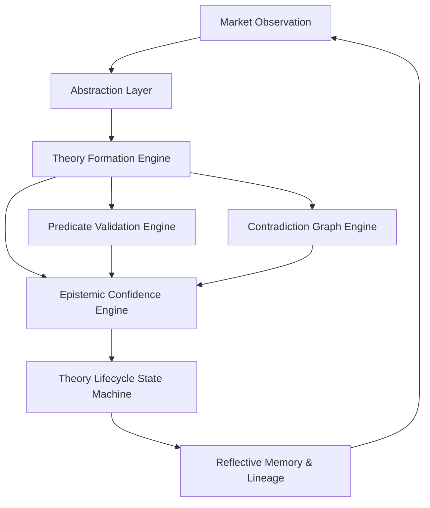

# Reflective Cognition Substrate — Architecture & Research Overview

## Executive Summary

**DP-Core Phase 1 Substrate** is an evolving, production-grade reflective cognition research substrate designed to explore:

- Longitudinal cognition across market regimes
- Reflective memory & historical continuity
- Theory formation, mutation, retirement, and revival
- Falsifiable hypothesis testing and predicate validation
- Interpretable, deterministic epistemic confidence evolution
- Explicit graph-based contradiction representation and conflict resolution
- Complete reasoning provenance and research diagnostics

Architecture coherence, persistence integrity, and deterministic reproducibility are prioritized over rapid feature velocity or hidden framework abstractions.

---

## Cognition Pipeline Architecture

The reflective cognition loop processes daily observations through seven explicit, sequential stages:

1. **Observation & Abstraction**: Converts raw market data into structured semantic abstractions.
2. **Theory Formation & Mutation**: Generates or mutates causal mechanisms and explanatory claims.
3. **Predicate Formation & Falsification**: Constructs explicit, executable predicates from newly formed claims to evaluate against future replay data.
4. **Epistemic Confidence Evolution**: Calculates confidence updates as deterministic, interpretable functions of empirical evidence, predictions, and reflection.
5. **Contradiction Graphing & Resolution**: Registers competing hypotheses as explicit graph edges (`ContradictionEdge`) and resolves conflicts using multi-signal strength without deleting losing theories prematurely.
6. **Theory Lifecycle Transitions**: Governs theory states (`DRAFT` $\rightarrow$ `CANDIDATE` $\rightarrow$ `ACTIVE` $\rightarrow$ `WEAKENING` $\rightarrow$ `RETIRED` $\rightarrow$ `ARCHIVED`) via authoritative transition validation rules.
7. **Reflective Memory & Lineage**: Persists reasoning lineage, memory hits, and lesson extraction for historical continuity.

---

## Key Subsystem Overview

### 1. LLM I/O Ledger (`interfaces/llm_ledger.py`)
Provides transparent, deterministic LLM prompt-response recording and replay:
- **Modes**: `LIVE` (executes live LLM calls and records responses), `REPLAY` (performs zero live LLM calls, serving exclusively from ledger JSON), and `AUTO` (records missing ledger entries).
- **Determinism**: Prompt hashing via SHA-256 ensures exact key matching. Missing entries in `REPLAY` mode raise explicit `LedgerMissError` exceptions.

### 2. Event Bus & Observer Decoupling (`core/event_bus.py` & `core/events.py`)
Decouples cognition producers from consumers using strongly-typed Pydantic domain events:
- **Events**: `ObservationCreated`, `MechanismGenerated`, `TheoryCreated`, `TheoryUpdated`, `TheoryRetired`, `ReflectionCompleted`, `PredictionGenerated`.
- **Properties**: Synchronous deterministic dispatch order, subscriber exception isolation, and optional telemetry logging.

### 3. Theory Lifecycle State Machine (`core/theory_state_machine.py`)
Consolidates scattered conditional state logic into a single authoritative lifecycle model:
- **States**: `DRAFT`, `CANDIDATE`, `ACTIVE`, `WEAKENING`, `RETIRED`, `ARCHIVED`.
- **Validation**: Enforces strict transition rules and explicit revival criteria (requires empirical evidence support $\ge 0.50$ or active regime match). Rejects illegal transitions with `InvalidStateTransitionError`.

### 4. Epistemic Confidence Engine (`cognition/epistemics/confidence_engine.py`)
Centralizes all confidence evolution into an interpretable, deterministic model:
- **Interface**: `update_confidence(theory, evidence, contradictions, prediction_results, reflection_feedback)`
- **Output**: Returns updated confidence and a structured `ConfidenceReport` detailing previous/new confidence, net delta, individual factor contributions (`supporting_evidence`, `contradictory_evidence`, `prediction_outcome`, `reflection_quality`, `theory_reuse`, `theory_age`), and a natural language justification.

### 5. Predicate Validation Framework (`validation/predicate_validation_engine.py`)
Makes generated mechanisms explicitly falsifiable:
- **Cycle**: Form predicates post-theory creation $\rightarrow$ Store in pending queue $\rightarrow$ Evaluate matured predicates against observed market data $\rightarrow$ Record outcome (`CONFIRMED`, `PARTIALLY_CONFIRMED`, `REJECTED`, `INSUFFICIENT_EVIDENCE`) $\rightarrow$ Feed impact into confidence updates.

### 6. Memory Retrieval Quality & Provenance (`memory/provenance.py`)
Improves transparency of memory retrieval and theory reasoning lineage:
- **Metrics**: Captures `retrieval_score`, `ranking`, `similarity`, `recency_contribution`, `usefulness_estimate`, and `ignored_candidates` for every query.
- **Provenance**: Every `Theory` carries `ReasoningProvenance` linking `observations_used`, `mechanisms_used`, `retrieved_memories`, `reflections_consulted`, and `validation_results_incorporated`.

### 7. Contradiction Graph & Epistemic Resolution (`cognition/contradiction/`)
Treats contradictions as first-class knowledge:
- **Graph (`ContradictionGraph`)**: Tracks competing theories as nodes and contradiction relations as directed edges with statuses (`ACTIVE`, `RESOLVED`, `SUPERSEDED`, `PENDING_INVESTIGATION`).
- **Resolver (`ContradictionResolver`)**: Evaluates competing hypotheses using multi-signal epistemic strength (prediction performance, validation history, accumulated evidence, memory reuse, reflection quality) without deleting losing theories.

### 8. Observability & Research Diagnostics (`diagnostics/`)
Captures detailed diagnostic telemetry across 9 cognition dimensions:
- **Collector (`EpistemicEventCollector`)**: Records events from observations, mechanisms, theories, confidence reports, predicate validations, contradictions, reflections, memory retrievals, and predictions.
- **Exporter (`ResearchReportGenerator`)**: Renders expanded research reports in both structured **JSON** (`data/research_report.json`) and publication-ready **Markdown** (`data/research_report.md`).

---

## Determinism & Verification

The substrate enforces strict replay determinism:
- Running consecutive replays on identical input datasets yields **100% identical outputs**, theory lineage paths, state machine transitions, predicate validation results, confidence evolution reports, and research diagnostics.
- Verification test suite: `poetry run pytest tests/test_replay_determinism.py`

---

## Current Limitations & Future Research Directions

### Current Limitations
1. Single-asset focus in current replay default configurations.
2. Synchronous event bus dispatch suitable for local single-process execution.
3. Memory retrieval candidate scoring uses weighted similarity without dynamic vector index scaling.

### Future Research Directions
1. Multi-asset cross-market causal mechanism propagation.
2. Async event bus dispatch for distributed cognitive worker pools.
3. Automated macro-historical theory synthesis and principle extraction.
