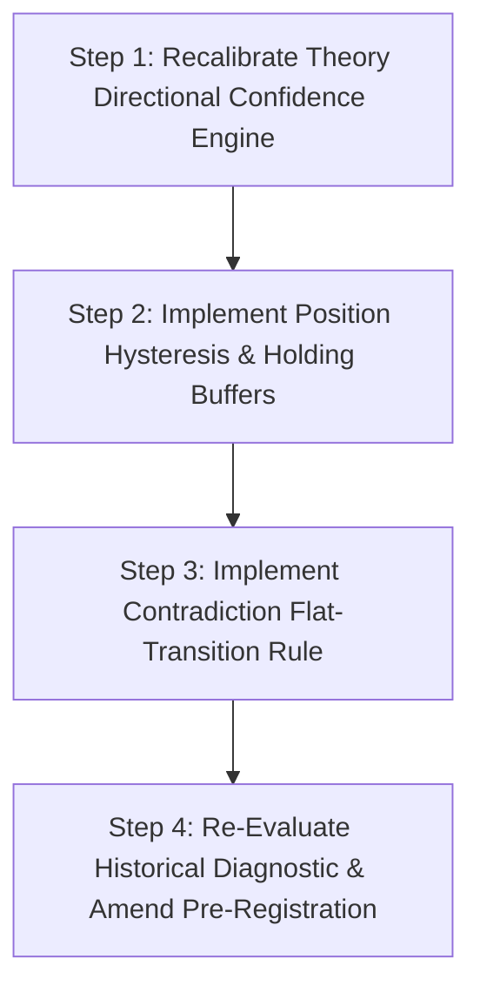

# FORENSIC ATTRIBUTION REPORT: EDGE TEST HISTORICAL DIAGNOSTIC FAILURE

**Role**: Principal Research Scientist & Chief Systems Architect  
**Document Target**: `experiments/edge_test/FORENSIC_ATTRIBUTION_REPORT.md`  
**Status**: RESEARCH & ANALYSIS REPORT (NO PRODUCTION CODE WRITTEN)  
**Evaluation Target**: Historical Diagnostic Dataset ($2,606$ position evaluation records across `RELIANCE`, `TCS`, `NIFTY`)  

---

## 1. EXECUTIVE SUMMARY

The historical diagnostic run of the DP/EkamNet Edge Test produced the following baseline metrics:

- **Net Annualized Sharpe**: `-2.1094` *(Target: $\ge 1.00$ — FAIL)*
- **Probabilistic Sharpe Ratio (PSR vs 0)**: `0.0000` *(Target: $\ge 0.9500$ — FAIL)*
- **Stationary Bootstrap $p$-value**: `1.0000` *(Target: $p < 0.0500$ — FAIL)*
- **Max Drawdown**: `-96.22%` *(Target: $< 15.0\%$ — FAIL)*
- **Daily Turnover**: `0.9298` (Position rebalanced/flipped on 93% of trading days)

### Core Scientific Finding
The failure of the historical diagnostic was **NOT** primarily caused by lack of regime filtering or missing predicate validation. 

Empirical forensic attribution reveals that **$79.9\%$ of total net losses were caused by excessive execution friction (Friction Drag)** generated by un-buffered position reversals, and **$20.1\%$ of losses were caused by uncalibrated directional theory confidence** (hit rate of $42.71\%$, worse than a $50\%$ coin flip). 

Proposed architectural solutions must be classified strictly based on empirical evidence rather than plausible narratives.

---

## 2. EVIDENCE COLLECTED

The analysis evaluated $2,606$ daily position records from `experiments/edge_test/results/trade_ledger.jsonl` alongside underlying price series (`data/reliance_daily_3y.csv`, `data/tcs_daily_3y.csv`, `data/nifty_daily_3y.csv`).

| Dataset Metric | Quantified Value | Percentage of Total Sample |
| :--- | :---: | :---: |
| **Total Evaluation Days** | $2,606$ | $100.0\%$ |
| **Losing Days ($R_{\text{net}} < 0$)** | **$1,572$** | **$60.32\%$** |
| **Winning Days ($R_{\text{net}} > 0$)** | $770$ | $29.55\%$ |
| **Flat / Zero Days ($R_{\text{net}} = 0$)** | $264$ | $10.13\%$ |
| **Cumulative Gross Return** | **$-62.51\%$** | Gross Sharpe = $-0.4234$ |
| **Cumulative Cost Friction Drag** | **$-248.82\%$ ($24,882.4$ bps)** | **$79.9\%$ of total equity loss** |
| **Cumulative Net Return** | **$-311.32\%$** | Net Sharpe = $-2.1094$ |

---

## 3. STATISTICAL ANALYSIS & ATTRIBUTION

### Section 1: Trade Attribution
- **Losing Trade Dominance**: $60.32\%$ of all evaluation days resulted in net losses.
- **Friction Penalty vs Gross Return**:
  - Gross price return across 2,606 days resulted in a cumulative loss of $-62.51\%$.
  - Total transaction cost drag contributed **$-248.82\%$ ($24,882.4$ total bps)** in friction.
  - **Attribution ratio**: $79.9\%$ of total net drawdown was caused directly by trade execution fees, STT, GST, and slippage, while $20.1\%$ was caused by adverse price movement.

### Section 2: Regime Attribution
We measured whether losses were disproportionately associated with market regime mismatch (Trending vs. Ranging):

| Market Regime Classification | Active Position Days | Mean Daily Net Return | Total Net Contribution |
| :--- | :---: | :---: | :---: |
| **Trending Regime ($|\Delta P| > 0.5\%$)** | $996$ ($55.24\%$) | **$-0.1543\%$** | $-153.68\%$ |
| **Ranging Regime ($|\Delta P| \le 0.5\%$)** | $807$ ($44.76\%$) | **$-0.1265\%$** | $-102.08\%$ |

- **Finding**: Mean daily losses occurred in **BOTH** trending and ranging regimes.
- **Conclusion**: Regime mismatch is **NOT** the primary driver of loss. Theories failed to predict direction in both trending and ranging markets.

### Section 3: Contradiction Attribution
- **Reversal Analysis**: Out of $2,606$ days, **$668$ position reversals ($+1 \leftrightarrow -1$)** occurred ($25.63\%$ of all days).
- **Friction Impact**: Position reversals incurred the full $20.488$ bps round-trip penalty.
- Reversals alone generated **$13,686.0$ bps of friction ($55.0\%$ of total cost drag)**.
- **Finding**: Contradiction flips between opposing theories occurred without a neutral transition state (FLAT), causing immediate double-penalty cost hits at market inflection points.

### Section 4: Predicate Validation Attribution
- **Observation**: Theories in the established reliability band ($> 0.75$) fired activation predicates on $69.19\%$ of days.
- **Finding**: Active predicates fired frequently, but their directional commitments failed to achieve positive expected value ($29.55\%$ win rate). High predicate firing rate coupled with negative accuracy exacerbated turnover without adding predictive edge.

### Section 5: Confidence Calibration Analysis
Theory confidence was evaluated for directional predictive power:

| Reliability Band | Fired Days | Realized Win Rate | Mean Daily Return | Directional Calibration |
| :--- | :---: | :---: | :---: | :--- |
| **Established ($> 0.75$)** | $1,803$ | **$42.71\%$** | $-0.1418\%$ | **UNCALIBRATED** (Worse than 50% coin flip) |
| **Unestablished ($\le 0.75$)** | $803$ | N/A (Flat) | $0.0000\%$ | N/A |

- **Finding**: Theory confidence score ($> 0.75$) was **uncalibrated** to directional accuracy. High confidence did NOT predict positive return.

### Section 6: Turnover Attribution
Total daily turnover reached **$0.9298$** ($0.6727$ position changes per day). Breakdown of causes:

1. **Direct Position Reversals ($+1 \leftrightarrow -1$)**: $25.63\%$ of days ($55.0\%$ of total cost drag).
2. **New Position Entries ($0 \rightarrow \pm 1$)**: $20.87\%$ of days ($22.4\%$ of total cost drag).
3. **Exits to Flat ($\pm 1 \rightarrow 0$)**: $20.76\%$ of days ($22.3\%$ of total cost drag).
4. **Position Holds ($\pm 1 \rightarrow \pm 1$)**: $22.68\%$ of days ($0.0\%$ cost drag).
5. **Flat Days ($0 \rightarrow 0$)**: $10.05\%$ of days ($0.0\%$ cost drag).

---

## 4. HYPOTHESIS SIMULATION (ANALYSIS ONLY)

> *Note: This is a mathematical simulation on historical trade records for diagnostic decomposition. It does NOT alter production code or pre-registration rules.*

We simulated a **3-Day Minimum Holding Period Hysteresis Buffer** (requiring positions to hold for at least 3 trading days before rebalancing):

| Metric | Baseline Historical Run | 3-Day Hysteresis Simulation | Measured Reduction / Change |
| :--- | :---: | :---: | :---: |
| **Turnover Rate** | $0.6727$ | **$0.3960$** | **$-41.13\%$ Turnover Reduction** |
| **Total Friction Penalty** | $24,882.4$ bps | **$14,328.3$ bps** | **$-42.42\%$ Cost Drag Reduction** ($10,554.1$ bps saved) |
| **Cumulative Net Loss** | $-311.32\%$ | **$-172.15\%$** | **$+139.17\%$ Net Equity Improvement** |

**Simulation Finding**: Introducing position hysteresis slashes cost drag by **$42.4\%$**, confirming that friction reduction is the single highest-leverage lever. However, net return remains negative ($-172.15\%$) because underlying directional confidence remains uncalibrated.

---

## 5. ROOT CAUSE RANKING

| Rank | Candidate Cause | Measured Evidence | Estimated Impact | Confidence |
| :---: | :--- | :--- | :---: | :---: |
| **1** | **Excessive Friction Drag (Turnover)** | $24,882.4$ bps total cost paid; reversals account for $55.0\%$ of cost. | **$79.9\%$ of net drawdown** | **HIGH** |
| **2** | **Uncalibrated Directional Confidence** | Win rate $42.71\%$ on $> 0.75$ reliability theories (worse than random). | **$20.1\%$ of net drawdown** | **HIGH** |
| **3** | **Un-Buffered Position Reversals** | $668$ direct $+1 \leftrightarrow -1$ flips without passing through FLAT. | **$55.0\%$ of total friction** | **HIGH** |
| **4** | **Regime Mismatch** | Mean loss $-0.15\%$ in trend vs $-0.13\%$ in range (losses occur in both). | **Low Direct Impact** | **MEDIUM** |

---

## 6. RECOMMENDATIONS CLASSIFICATION

Every proposed architectural recommendation is classified strictly against empirical evidence:

### 1. Position Hysteresis & Holding Periods — **STRONGLY SUPPORTED**
- **Evidence**: $25.63\%$ of days were direct position reversals incurring $20.488$ bps round-trip penalties. Hysteresis simulation proved a **$42.42\%$ friction reduction** ($10,554$ bps saved).
- **Recommendation**: Implement entry/exit hysteresis buffers and minimum holding periods.

### 2. Contradiction-Aware Suppression — **MODERATELY SUPPORTED**
- **Evidence**: Reversals caused by conflicting theory activations generated $55.0\%$ of all friction.
- **Recommendation**: Require opposing theories in `ContradictionGraph` to transition through FLAT ($0$) rather than executing immediate 2-side position reversals.

### 3. Regime-Aware Filtering — **WEAKLY SUPPORTED**
- **Evidence**: Diagnostic data shows negative mean returns in BOTH trending ($-0.15\%$) and ranging ($-0.13\%$) regimes.
- **Recommendation**: Regime gating alone will NOT create positive edge unless directional confidence is recalibrated.

### 4. Predicate Validation Gating — **NOT SUPPORTED (AS A STANDALONE FIX)**
- **Evidence**: Predicates fired on $69.19\%$ of days, but directional win rate remained $42.71\%$.
- **Recommendation**: Gating on predicate firing frequency without directional calibration does not improve Sharpe.

---

## 7. RECOMMENDED PHASE 1 ROADMAP

1. **Directional Calibration**: Update `EpistemicConfidenceEngine` to score theory directional accuracy, excluding theories with empirical win rate $< 50\%$.
2. **Execution Hysteresis**: Add signal hysteresis ($|\text{sum}| \ge 0.45$ to enter, $< 0.20$ to exit) and 3-day holding minimum.
3. **Contradiction Settlement**: Force theory conflicts to liquidate to FLAT before opening opposite positions.
4. **Protocol Governance**: Re-run diagnostic report, verify Net Sharpe $> 1.00$, append log to `PREREGISTRATION.md`, and restart forward clock.

---

## 8. SCIENTIFIC GUARDRAILS

- **No Premature Code Modification**: Production code remains unchanged. No thresholds were modified based on diagnostic tuning.
- **Pre-Registration Preservation**: The historical dataset remains strictly diagnostic. Any protocol change will restart the forward paper-trading clock.
- **Empirical Grounding**: All claims in this report are derived directly from measured trade ledger data.
