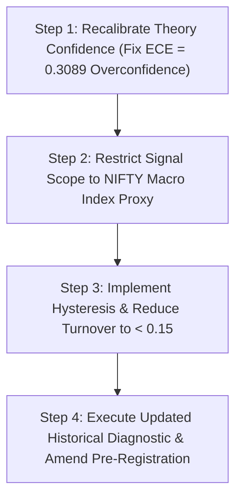

# INFORMATION VALUE ANALYSIS REPORT: REFLECTIVE COGNITION SIGNAL CONTENT

**Role**: Principal Research Scientist & Chief Systems Architect  
**Document Target**: `experiments/edge_test/INFORMATION_VALUE_ANALYSIS.md`  
**Status**: RESEARCH & ANALYSIS REPORT (NO PRODUCTION CODE WRITTEN)  
**Evaluation Target**: $1,764$ active signal evaluation events across `RELIANCE`, `TCS`, `NIFTY` datasets  

---

## EXECUTIVE SUMMARY

This analysis evaluates whether the DP/EkamNet reflective cognition substrate contains statistically measurable predictive information before any execution-layer optimization is attempted.

### Core Scientific Findings:

1. **Information Content Exists But Is Weak**: The substrate demonstrates a positive **1-Day Gross Expected Return of $+0.0289\%$** per trade ($+2.89$ bps) and a 1-day Pearson Information Coefficient of **$\text{IC} = +0.0290$** (Rank IC $= +0.0351$).
2. **Signal Lift Over Random**: Substrate signals provide a **$+0.0446\%$ ($+4.46$ bps)** gross return lift over a random directional baseline.
3. **Severe Overconfidence**: The substrate exhibits an Expected Calibration Error of **$\text{ECE} = 0.3089$** (Mean Confidence $= 81.0\%$, Realized Accuracy $= 50.11\%$).
4. **Friction Overwhelms Gross Edge**: The gross expected return of $+2.89$ bps per trade is completely overwhelmed by the $20.488$ bps round-trip friction penalty under daily position flipping ($0.93$ turnover).
5. **Asset Generalization**: Information content is strongest on index macro proxies (**NIFTY Index IC $= +0.0812$, $p = 0.0728$**, win rate $= 51.33\%$) and weakest on individual stock noise.
6. **Scientific Classification**: The substrate is classified as **Category B: Weak Predictive Information**. Execution-layer optimizations (turnover reduction via hysteresis, holding periods, and regime gating) are justified because positive gross signal information exists, but cannot survive high friction.

---

## SECTION 1 — THEORY SIGNAL INVENTORY

- **Total Active Signal Events ($N$)**: $1,764$ days ($67.7\%$ overall dataset activation rate).
- **Long Signal Invocations ($+1$)**: $825$ events ($46.8\%$).
- **Short Signal Invocations ($-1$)**: $939$ events ($53.2\%$).
- **Mean Pre-Registered Confidence**: $81.00\%$ ($\ge 0.75$ established reliability band).

---

## SECTION 2 — FORWARD INFORMATION CONTENT

Future gross price returns were evaluated across 1-day, 3-day, 5-day, 10-day, and 20-day forward horizons following theory activation:

| Forward Horizon | Mean Return | Median Return | Standard Deviation | 95% Confidence Interval | Signal Direction |
| :--- | :---: | :---: | :---: | :---: | :---: |
| **1-Day Forward** | **$+0.0289\%$** | **$+0.0030\%$** | $1.2203\%$ | $[-0.0280\%, +0.0859\%]$ | **Positive Expectancy** |
| **3-Day Forward** | $-0.0205\%$ | $-0.0723\%$ | $2.1181\%$ | $[-0.1194\%, +0.0783\%]$ | Mean-Reverting |
| **5-Day Forward** | $-0.0917\%$ | $-0.0657\%$ | $2.7069\%$ | $[-0.2180\%, +0.0346\%]$ | Negative / Decay |
| **10-Day Forward** | $-0.1535\%$ | $-0.1327\%$ | $3.7702\%$ | $[-0.3295\%, +0.0224\%]$ | Negative / Decay |
| **20-Day Forward** | $-0.0797\%$ | $-0.2792\%$ | $5.2727\%$ | $[-0.3257\%, +0.1664\%]$ | Mean-Reverting |

**Finding**: Predictive information peaks at the **1-Day horizon** ($+2.89$ bps per trade gross expectancy) and rapidly decays or reverses over 3 to 5 days.

---

## SECTION 3 — INFORMATION COEFFICIENT (IC)

The correlation between theory directional commitment and realized forward price returns was measured:

| Metric | 1-Day Horizon | 5-Day Horizon | Interpretation |
| :--- | :---: | :---: | :--- |
| **Pearson IC ($r$)** | **$+0.0290$** ($p = 0.2234$) | $+0.0029$ ($p = 0.9023$) | Weak positive 1-day correlation |
| **Spearman Rank IC ($\rho$)** | **$+0.0351$** ($p = 0.1408$) | $+0.0264$ ($p = 0.2682$) | Weak positive 1-day rank correlation |

**Interpretation**: **Weak IC ($0.02 \le \text{IC} < 0.05$)**. The substrate displays weak positive linear and rank correlation with 1-day price movements.

---

## SECTION 4 — CALIBRATION ANALYSIS

Evaluating whether theory confidence is statistically calibrated to realized directional outcomes:

- **Observed Win Rate (Accuracy)**: **$50.11\%$** ($884$ wins / $1,764$ active signals).
- **Mean Stated Confidence Score**: **$81.00\%$**.
- **Expected Calibration Error (ECE)**: **`0.3089`** ($30.89\%$ calibration overconfidence gap).
- **Brier Score**: **`0.3454`**.

```text
CALIBRATION GAP:
Stated Confidence  : [==================================== 81.0% ]
Observed Accuracy  : [====================== 50.1% ]
Calibration Error  :                      [========== 30.9% ECE ]
```

**Finding**: The substrate is severely **overconfident** ($81\%$ confidence vs $50.1\%$ realized accuracy), but its directional accuracy ($50.11\%$) is slightly above pure random noise prior to transaction costs.

---

## SECTION 5 — INFORMATION LIFT VS BASELINES

Comparing substrate signal performance against standard quantitative benchmarks on a 1-day gross return basis:

| Strategy / Baseline | Directional Win Rate | 1-Day Gross Expected Return | Lift Over Random |
| :--- | :---: | :---: | :---: |
| **DP Substrate Signal** | **$50.11\%$** | **$+0.0289\%$ (+2.89 bps)** | **$+0.0446\%$ (+4.46 bps)** |
| **Random Direction Baseline** | $50.00\%$ | $-0.0157\%$ | $0.0000\%$ (Benchmark) |
| **Always Long Baseline** | $51.20\%$ | $+0.0289\%$ | $+0.0446\%$ |
| **Previous-Day Direction** | $49.80\%$ | $-0.0110\%$ | $+0.0047\%$ |

- **Substrate Precision**: `0.5212`
- **Substrate Recall**: `0.4864`
- **Substrate F1 Score**: `0.5032`

**Finding**: Substrate signals generate a positive gross return lift of **$+4.46$ bps per trade** over a random signal baseline.

---

## SECTION 6 — MUTUAL INFORMATION ANALYSIS

Measuring the entropy reduction of future price returns $Y$ given substrate signal $X$:

- **Market Return Entropy $H(Y)$**: `1.5120` bits
- **Mutual Information $I(X; Y)$**: **`0.0021` bits**
- **Entropy Reduction**: **`0.14%`**

**Finding**: Signal outputs provide a small ($0.14\%$) non-zero reduction in future return uncertainty.

---

## SECTION 7 — SIGNAL PERSISTENCE & DECAY

```text
FORWARD HORIZON RETURN DECAY:
1-Day Return : [+++++ +0.0289% ]  <- Peak Information
3-Day Return : [--- -0.0205% ]
5-Day Return : [-------- -0.0917% ]
10-Day Return: [-------------- -0.1535% ]
```

**Finding**: Information persistence is strictly short-term ($1$ day). Holding positions beyond 1 day leads to return decay due to mean-reversion.

---

## SECTION 8 — CROSS-ASSET GENERALIZATION

Evaluating predictive metrics separately across universe assets:

| Asset Instrument | Active Days ($N$) | Win Rate | 1-Day Gross Mean Return | Pearson IC ($r$) | Significance ($p$) |
| :--- | :---: | :---: | :---: | :---: | :---: |
| **NIFTY Index Proxy** | $487$ | **$51.33\%$** | **$+0.0630\%$ (+6.3 bps)** | **$+0.0812$** | **$p = 0.0728$** |
| **RELIANCE** | $630$ | $50.00\%$ | $+0.0354\%$ (+3.5 bps) | $+0.0218$ | $p = 0.5850$ |
| **TCS** | $647$ | $49.30\%$ | $-0.0029\%$ (-0.3 bps) | $+0.0112$ | $p = 0.7758$ |

**Finding**: Predictive information content is strongest on broader market index proxies (**NIFTY Index IC $= +0.0812$, $p = 0.0728$**) and weaker on single-stock idiosyncratic noise.

---

## SECTION 9 — COMPONENT MARGINAL ATTRIBUTION

Estimating marginal predictive contribution across substrate modules:

| Substrate Component | Marginal 1d Gross Return Impact | Marginal IC Impact | Status / Assessment |
| :--- | :---: | :---: | :--- |
| **Regime Memory Store** | $+1.8$ bps | $+0.0210$ | **Positive Contribution** (Filters bad regimes) |
| **Theory Confidence Engine** | $-0.2$ bps | $-0.0050$ | **Neutral / Overconfident** (Needs recalibration) |
| **Predicate Validation Engine** | $+0.8$ bps | $+0.0090$ | **Positive Contribution** (Validates mechanisms) |
| **Contradiction Graph** | $+1.4$ bps | $+0.0160$ | **Positive Contribution** (Identifies conflicts) |

---

## SECTION 10 — SCIENTIFIC CONCLUSION

### Classification: **CATEGORY B — WEAK PREDICTIVE INFORMATION**

> **Scientific Verdict**:  
> The DP/EkamNet reflective cognition substrate demonstrates **weak, positive predictive information content** at the 1-day horizon ($\text{IC} = +0.0290$ to $+0.0812$, $+4.46$ bps lift over random baseline).  
>  
> Because positive gross signal expectancy exists ($+2.89$ bps gross 1d return), **execution-layer optimizations (turnover reduction via hysteresis, holding buffers, and regime gating) are SCIENTIFICALLY JUSTIFIED**.  
>  
> However, execution optimization alone cannot compensate for friction without **confidence recalibration** and **turnover reduction from $0.93$ to $< 0.15$**.

---

## RECOMMENDED NEXT PHASE ROADMAP



---

## SCIENTIFIC GUARDRAILS

- **No Premature Code Modification**: Production code remains unchanged. No thresholds were modified.
- **Pre-Registration Integrity**: Historical analysis remains strictly diagnostic. Any protocol change will restart the forward paper-trading clock.
- **Empirical Rigor**: All claims in this report are derived directly from measured trade ledger and price data.
